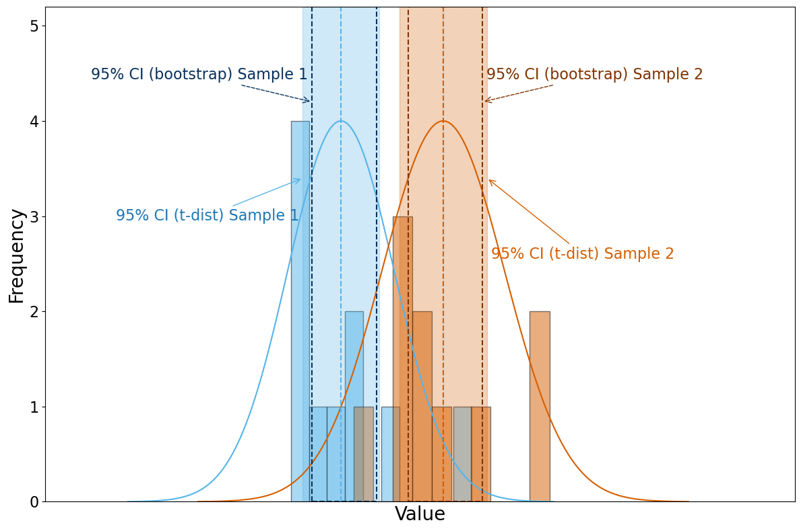
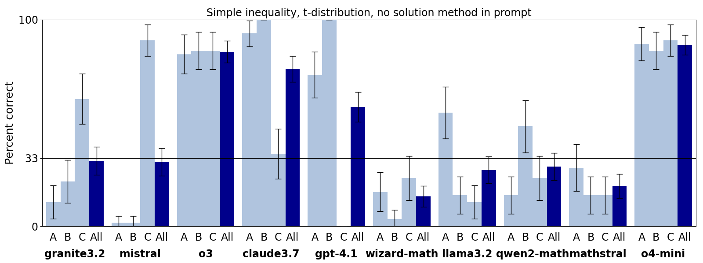

# Uncertainty Quantification by LLMs

Trustworthy UQ is a unique challenge for models and agents because it is inherently ambigu-
ous—driven by a wide range of subjective methodological choices. This ambiguity complicates the
task of determining whether a model’s approach to UQ is reliable or trustworthy. Therefore, it is
critical to characterize both the subjective choices that models make autonomously and how well
they perform when prompted to use specific UQ techniques.

Tether is a model-agnostic suite of benchmarks for LLM-based agents and tools focused exclusively
on, arguably, the most basic form of quantitative data analysis: the estimation of an empirical
inequality under uncertainty. Before addressing complex, noisy, and ambiguous real-world problems,
a large language model (LLM) or agent should demonstrate competence on simple uncertainty
quantification (UQ) tasks. Strong performance at simple UQ problems is arguably a necessary,
though not sufficient, criterion for establishing the trustworthiness of a LLM or agent at UQ.

Models can perform UQ in trustworthy manner without any confirmation of UQ understanding.
While distinguishing between pattern-matching and true understanding is vexing for qualitative tasks
this distinction becomes less critical in quantitative domains like UQ because model outputs can be
directly and objectively compared to human-generated results. Consider that human understanding
is rarely judged by inspecting internal cognitive processes; instead, it is typically assessed through
behavior ([Gonzalez Barman et al. 2024](https://link.springer.com/article/10.1007/s11023-024-09657-1)). The quantitative benchmarks we present do not adjudicate whether models understand UQ in a human-like sense, but rather the benchmarks evaluate how well model behavior aligns with
scientific reasoning and common subjective methodological choice

## Why is UQ a unique challenge?
Quantitative analyses depend upon uncertainty quantification (UQ) because no measurement, simulation, nor observation is perfectly free of error or bias. Unlike formal mathematical proofs and deductive reasoning, UQ is an explicitly inductive task that accounts for the platonic imperfection of the real world. Thus, UQ requires problem-specific judgments related to the data at hand (e.g., outlier detection and treatment of outliers, knowledge of variable inter-dependencies, etc.), discipline-specific standards (e.g., [4-5σ levels of significance are typically required for the acceptance of a discovery in exoplanetary science](https://www.cam.ac.uk/stories/strongest-hints-of-biological-activity)), and/or may depend upon decision-making
stakes. 

## Why is UQ important?
Quantitative analyses are essential for science.
The basic UQ capabilities assessed by these benchmarks (the estimation of empirical inequalities under uncertainty) have played an essential role in
many scientific breakthroughs.
Einstein's theory of general relativity superseded Newtonian theory when Eddington measured Δθ=1.98±0.16 arcsec deflection of starlight around the sun because the lower bound of Eddington's confidence interval (Δθ=1.82 arcsec) is closer to the relativistic prediction of Δθ=1.75 arcsec (Δθ in the image shown below, from [Dittrich et al. 2024](https://baas.aas.org/pub/2024n9i040/release/1)) compared with Newtonian prediction of Δθ=0.875 arcsec. 

# How to use this code

## Installation
Install using the provided Makefile. The makefile expects a python environment will be available. This repo is setup with the expectation that all users and containers
will be using virtual environments to manage python dependencies. We do not enforce any specific virtual environment. Options include conda, venv, pyenv, etc.

- To install, simply run `make install`
- For a development environment, instead run `make dev_install`

The makefile also provides testing, formatting and linting rules via `make test` `make format` and `make lint`. WARNING: Before running `make test` ensure that you have set the environement variables below.

## Set your path for benchmark data
Prior to generating, running, or analyzing benchmarks (or running pytests) you need to set the path to your benchmarks directory. This is where folders will be created that will: store the tests with just questions in '../blank', store the completed tests with LLM responses in '../completed', and store the graded tests in '../graded'. Set the path in the terminal with:

`export PATH_TO_BENCHMARKS=/$YOUR_PATH_TO_BENCHMARKS$/benchmark_results`

Alternatively, you can add the export command above into your ~/.bashrc or ~/.zshrc file and source them. In bash this looks like:

`echo 'export PATH_TO_BENCHMARKS="/$YOUR_PATH_TO_BENCHMARKS$/benchmark_results"' >> ~/.bashrc`

`source ~/.bashrc`

and you can check if it works with:

`echo $PATH_TO_BENCHMARKS`

## Generate a benchmark
To generate your blank tests (just questions), run the following command in the terminal:

`python3 -m tether.core.generator BENCHMARK`

Here, BENCHMARK is one of the names on the list in the prior section (e.g., SimpleInequality_tdist) The following command line arguments are available:
`--n_problems` : specify the number of questions in the test (defaults to 180, with 60 A,B, and C answer problems each split into 20 easy, medium, and hard problems)

`--n_numbers` : specify the length of the vectors in SimpleInequality tests (defaults to 10, not used in MediatedCausality)

`--make_plots` : will generate plots of the sample distributions against the pmfs and pdfs they were sampled from

For example:

`python3 -m tether.core.generator SimpleInequality_tdist --make_plots`

will generate a saved benchmark SimpleInequality_tdist_0.npz in /PATH_TO_BENCHMARKS/benchmarks/saved/ and figures from --make_plots for each problem in /PATH_TO_BENCHMARKS/benchmarks/saved/SimpleInequality_tdist_figures/. 

An example figure that shows the data generated for one SimpleInequality_tdist problem:

  

### Prompt customization

Benchmark prompts can be found in their respective files in /tether/benchmarks. (Note: The NeurIPS D&B paper submission refers to Complex Inequality benchmarks - these are the Mediated Causality benchmarks in this repository).

## Run a benchmark

`python3 -m tether.core.run BENCHMARK MODEL`

Be sure to include the index of the benchmark in BENCHMARK. For example, MediatedCausality_tdist_0 for the first MediatedCausality_tdist benchmark (you can repeatedly generate more of the same benchmark).

## Run a benchmark on agents that write and execute code

'python3 -m tether.core.run BENCHMARK MODEL --agent'

The --agent flag activates a three-agent system that will write code, run the code, and extract answers for the analyzing step. The run code agent will force the write code agent to re-write code if non-executable code is not generated. 10 attempts are given the model to write executable code. This number can be modified in proctor.py. 

### Running a set of benchmarks in serial

You can use `run_all.sh` to run all of the benchmarks listed in `run_all.sh` for the model specified at the top of `run_all.sh`.

## Analyze a benchmark

The generic command for analyzing a benchmark is:

`python3 -m tether.core.analyzer BENCHMARK_NPZ_FILENAME_WITHOUT_SUFFIX`

Calling the command above just loads the completed benchmark .npz file, nothing more. In practice you will want to do analyses called with command line arguments. For example:

`python3 -m tether.core.analyzer MediatedCausality_tdist_0_mistral_0 --grade_estimate --verbose`

This will estimate the grade of the completed benchmark saved in `MediatedCausality_tdist_0_mistral_0.npz` and will output to terminal the grades as it loops over all questions in the benchmark. 

The following command line arguments are available:
`--grader_model` : allows you to choose which model you want to act as the grading agent. Model must be included in a model list at the top of the analyzer.py file.

`--print_vars` : prints the variables saved in the .npz file to the terminal.

`--print_responses` : prints every question, LLM response, and solution for the entire benchmark to terminal.

`--grade_estimate` : uses a LLM grader and deterministic pattern-recognition grader to analyze LLM responses. If the LLM grader and the deterministic grader agree that the LLM response is correct/incorrect, then that correct/incorrect value is stored. In this case, a graded benchmark file is saved with the suffix `_final_grade.npz`. If the LLM grader and the deterministic grader disagree that the LLM response is correct/incorrect, then the problem is flagged for human review and the graded benchmark file is saved with the suffix `_provisional_grade.npz`.

`--human_review` : loops over all problems that were flagged for human review with `--grade_estimate` and saved with the suffix `_provisional_grade.npz`. You can then manually label problems as correct/incorrect through command line interaction until all problems flagged for human review are done. Then the graded benchmark file is saved with the suffix `_final_grade.npz`.

### Provisional grading in serial

You can use `grade_all.sh` to do `--grade_estimate` in serial over all of the benchmarks listed in `grade_all.sh` for the model specified at the top of `grade_all.sh`.

## Plot results

You can used `plot.py` to plot graded models.

  

## Available benchmarks
The following benchmarks are available in this suite:
1. **SimpleInequality_tdist** Creates an exam with a specified length of questions with two vectors randomly sampled from a Gaussian distribution with target means and standard deviations and plugs them into the question "Is it more probable that a sample from Vector 1 is greater than a sample from Vector 2?" and generates the solutions to the questions using t-distribution 95% confidence intervals.
2. **SimpleInequality_bootstrap** Creates an exam with a specified length of questions with two vectors randomly sampled from a Gaussian distribution with target means and standard deviations and plugs them into the question "Is it more probable that a sample from Vector 1 is greater than a sample from Vector 2?" and generates the solutions to the questions using bootstrapped 95% confidence intervals.
3. **SimpleInequalityWithMethod_tdist** Creates an exam with a specified length of questions with two vectors randomly sampled from a Gaussian distribution with target means and standard deviations and plugs them into the question "Is it more probable that a sample from Vector 1 is greater than a sample from Vector 2? Use the standard eror of proportion and t-distribution to calculate the 95% confidence interval" and generates the solutions to the questions using t-distribution 95% confidence intervals. 
4. **SimpleInequalityWithMethod_bootstrap** Creates an exam with a specified length of questions with two vectors randomly sampled from a Gaussian distribution with target means and standard deviations and plugs them into the question "Is it more probable that a sample from Vector 1 is greater than a sample from Vector 2? Use bootstrap resampling to calculate the 95% confidence interval" and generates the solutions to the questions using bootstrapped 95% confidence intervals. 
5. **MediatedCausality_tdist** Creates an exam with a specified length of questions using a randomly generated frequency table for 8 combinations of the cause, effect, and mediator then asks the LLM "Calculate the 95\% confidence level intervals. Use the 95\% confidence levels to answer 'A' for yes, 'B' for no, or 'C' for uncertain" and generates the solutions to the questions using t-distribution 95% confidence intervals.
6. **MediatedCausality_bootstrap** Creates an exam with a specified length of questions using a randomly generated frequency table for 8 combinations of the cause, effect, and mediator then asks the LLM "Calculate 95\% confidence level by numerically estimating cumulative probabilities. Use the 95\% confidence levels to answer 'A' for yes, 'B' for no, or 'C' for uncertain" and generates the solutions to the questions using bootstrapped 95% confidence intervals.
7. **MediatedCausalityWithMethod_tdist** Creates an exam with a specified length of questions using a randomly generated frequency table for 8 combinations of the cause, effect, and mediator then asks the LLM " Use the front-door criterion to determine if smoking causes cancer from the provided data. Use the standard error of proportion and t distribution on the final front door probability difference to calculate the 95\% confidence level intervals. Use the 95\% confidence levels to answer 'A' for yes, 'B' for no, or 'C' for uncertain" and generates the solutions to the questions using t-distribution 95% confidence intervals.
8. **MediatedCausalityWithMethod_bootstrap** Creates an exam with a specified length of questions using a randomly generated frequency table for 8 combinations of the cause, effect, and mediator then asks the LLM "Use the front-door criterion of causal inference and only the provided data. Bootstrap the final front door probability difference to calculate 95\% confidence level by numerically estimating cumulative probabilities. Use the 95\% confidence levels to answer 'A' for yes, 'B' for no, or 'C' for uncertain" and generates the solutions to the questions using bootstrapped 95% confidence intervals.
9. **MediatedCausalitySmoking_tdist** Creates an exam with a specified length of questions using a randomly generated frequency table for 8 combinations of the cause, effect, and mediator then asks the LLM "Does smoking cause cancer?" and generates the solutions to the questions using t-distribution 95% confidence intervals.
10. **MediatedCausalitySmoking_bootstrap** Creates an exam with a specified length of questions using a randomly generated frequency table for 8 combinations of the cause, effect, and mediator then asks the LLM "Does smoking cause cancer?" and generates the solutions to the questions using bootstrapped 95% confidence intervals.

# Models

## API models

If you have OpenAI, Claude, or other API keys accessible through your .bashrc or .zshrc file, then these keys are accessed using os.getenv() in proctor.py. 

## Ollama models

To use ollama models:

1) Download ollama: https://ollama.com/download  
2) Open the downloaded zip, install   
3) Enter the following terminal command for each model you plan on using, for example:  

`$ ollama pull deepseek-r1:32b`   

Add the model to ollama_model_list at the top of source/proctor.py if it is not already in the list.

4) Once the model is downloaded, enter 

`$ ollama serve` 

This runs a server process that listens for API requests and should be left to run in the terminal. Open a new terminal and run tether command line commands in that terminal.

# Testing

Running the complete set of 57 unit tests with pytest takes roughly 3 minutes and 20 seconds on a desktop machine.

# Licenses
This project is licensed under the [MIT License](LICENSE.md).

# Copyright
LANL O4894

© 2025. Triad National Security, LLC. All rights reserved.

This program was produced under U.S. Government contract 89233218CNA000001 for Los Alamos National Laboratory (LANL), which is operated by Triad National Security, LLC for the U.S. Department of Energy/National Nuclear Security Administration. All rights in the program are reserved by Triad National Security, LLC, and the U.S. Department of Energy/National Nuclear Security Administration. The Government is granted for itself and others acting on its behalf a nonexclusive, paid-up, irrevocable worldwide license in this material to reproduce, prepare derivative works, distribute copies to the public, perform publicly and display publicly, and to permit others to do so.
